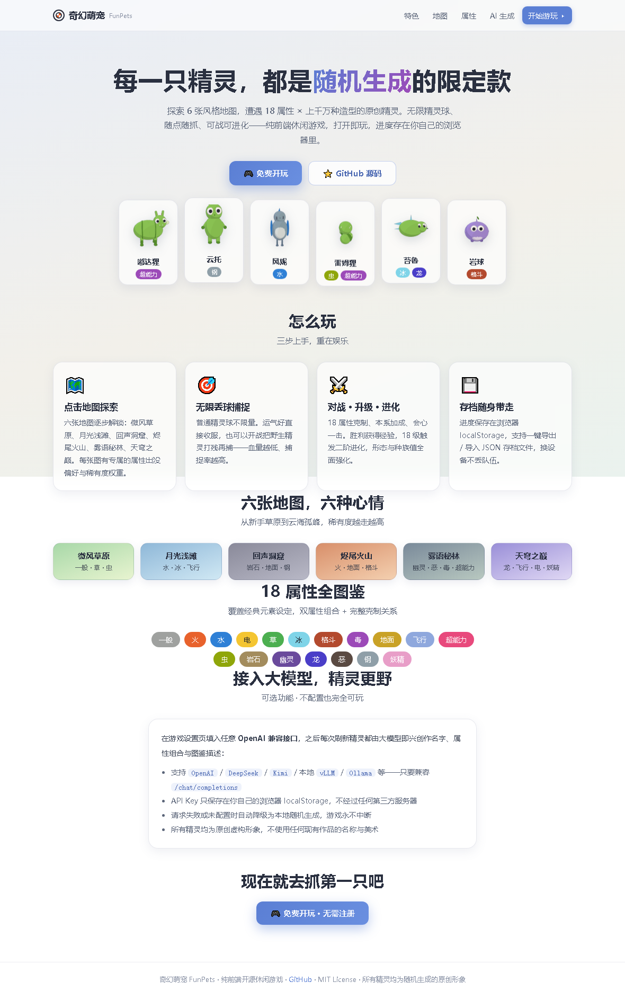

# FunPets 奇幻萌宠 🐾

[中文](README.md) | **English**

> 🌐 **Play online**: <https://samge0.github.io/funny-pets/> (promo page) · [Enter the game directly](https://samge0.github.io/funny-pets/app/)

A pure-frontend original monster-collecting casual game. Engineering model inspired by [Licoy/tihuqiche](https://github.com/Licoy/tihuqiche) (Vue 3 + Vite + Three.js + official GitHub Pages Actions deployment). All pets are randomly generated **original** 3D creatures with original names — no copyrighted content from any existing franchise.



## Features

- **3D original pets**: Three.js procedural modeling (sphere/capsule/cone primitive composition) across a dozen+ variation dimensions — body × head-body ratio × ears × tail × pattern × limbs × back spikes × horns × wings × eyes × mouth × palette — millions of combinations. Built-in breathing / swaying / wing-flapping idle animations.
- **Explore 6 maps**: Breezy Meadow → Moonlit Shore → Echo Cave → Ember Tail Volcano → Mist Whisper Forest → Sky Dome Peak (progressively unlocked by catch count), each with type preferences, rarity weights, and **wild level bands** — the further you go, the tougher they get.
- **Unlimited catching**: standard balls are free and infinite — throw directly, or battle to weaken first (lower HP = easier catch, with a live catch-rate display in battle).
- **Turn-based battles**: Pokémon-style damage formula, enlarged HP pools (10+ turns per fight on average), 18-type effectiveness chart, STAB bonus, critical hits, accuracy, status moves; tackle / hit-flash / damage-popups / screen-shake animations; swap pets when one faints.
- **Leveling & evolution**: wins grant EXP (40% shared across the party), evolving at Lv.18/36 — stat growth, move power-ups or new moves, size increase, back spikes and an aura.
- **Celebrations**: catch / level-up / evolution trigger full-screen celebration modals — star bursts, scale-in animation, 3D pet display, dex entry.
- **Collection**: encounter tracking + catch goal (30 pets); dex thumbnails are offscreen 3D-rendered snapshots.
- **Devour system**: battle wins may let your pet devour the foe's moves and body parts — empty slots grow instantly, existing slots can stack (up to 8) or replace; pattern/eyes are single-value slots that auto-replace; dex thumbnails reflect the loot live.
- **Soul chat (optional AI)**: every pet has its own personality (4 trait dimensions / verbal tic / likes / beliefs) and 3-layer memory; with an LLM configured you can chat with it (memories auto-compress), and during battles BOTH sides stream battle lines — wild pets come with a "territory invaded" wild persona.
- **Share & challenge**: one-click share links from the pet detail page (pure frontend, no backend) — friends can view the 3D pet in 360° (tap it to hop) and challenge it with their own pets (sparring never triggers devour/catch, and results never touch the sharer's save).
- **Gift pets**: gift links let a friend adopt a **clone** of your pet — you never lose yours. The clone's soul and AI chat start fresh with the receiver's own LLM setup; your API key never travels with the link.
- **Saves**: localStorage persistence + one-click JSON export/import (with schema validation against dirty data).
- **AI generation (optional)**: configure any OpenAI-compatible endpoint (Base URL / Model / API Key) in Settings and every encounter is generated by the LLM (name, types, lore) — 12s timeout + automatic retry + tolerant parsing, falling back to local random only when disabled or persistently failing. The API key never leaves your browser.
- **18 languages** 🌍: UI, battle logs, entity names (types / moves / maps / rarities / natures / parts) and all LLM output follow the language picked in Settings — defaults to your browser's language, switchable anytime, plus a 🌐 retranslate action that migrates existing pets' names & dex entries into the current language.

## Local development

Requires Node.js 18+.

```bash
npm install
npm run dev        # dev server with HMR (game at /app/)
npm run build      # output to dist/ (/ = promo page, /app/ = game)
npm run preview    # preview the production build locally
node tests/smoke.mjs   # Playwright smoke tests (build first; PLAYWRIGHT_CHANNEL=chrome reuses local Chrome)
node scripts/render-promo-pets.mjs  # regenerate promo 3D snapshots (run after changing appearance dimensions)
```

## Site structure

After deployment `/` is the promo page (random pet showcase, feature tour, AI intro) and `/app/` is the game. The promo page's pet showcase and type cloud are injected at build time by a script (`promo/main.js`) using real game data, with fixed-seed sampling so builds stay reproducible.

## Deploy to GitHub Pages

1. Create a repo named `funny-pets` (matching `base` in `vite.config.js`; rename both together).
2. Push code to `main`.
3. Repo **Settings → Pages → Build and deployment → Source** → choose **GitHub Actions**.
4. Every push then builds and deploys automatically; `.github/workflows/deploy.yml` is ready — no gh-pages branch or personal token needed.

Locally visit `http://127.0.0.1:4173/funny-pets/` (promo) and `http://127.0.0.1:4173/funny-pets/app/` (game).

## Docker deployment

The repo ships with a [Dockerfile](Dockerfile), [.dockerignore](.dockerignore) and [docker-compose.yaml](docker-compose.yaml): multi-stage build (Node runs `vite build` → nginx serves `dist/`), with nginx routes pre-configured for `base: '/funny-pets/'`.

```bash
docker compose up -d --build    # build & start (host port 4173 → container 80)
```

Then visit <http://localhost:4173/> (promo, redirects to `/funny-pets/`) and <http://localhost:4173/app/> (game). Change the port in `docker-compose.yaml` `ports`.

> The build stage's workdir is `/site` instead of the conventional `/app`: the project has an `app/` directory, and Vite mis-parses the absolute entry `/app/index.html` as a URL hitting `<root>/app/index.html` (the game page), which drops the promo entry from the build. See the Dockerfile comments.

## Project structure

```text
├── index.html              # promo page (site root /)
├── promo/
│   ├── main.js             # promo type-cloud injection (contrast-aware)
│   └── pets/*.png          # 3D pet snapshots (render script output)
├── app/index.html          # game entry (/app/)
├── scripts/
│   └── render-promo-pets.mjs  # promo 3D snapshot rendering (Playwright + WebGL)
├── src/
│   ├── App.vue / main.js    # app shell & entry
│   ├── components/
│   │   ├── Pet3D.vue        # 3D pet mount component (shared scene management)
│   │   └── Celebration.vue  # catch/level-up/evolution full-screen celebration
│   ├── data/
│   │   ├── types.js         # 18 types + full effectiveness chart
│   │   ├── maps.js          # 6 maps (type preferences / rarity weights / level bands / theme)
│   │   ├── moves.js         # move pools by type (all original names)
│   │   ├── names.js         # name pools / lore templates / natures / rarities
│   │   └── traits.js        # appearance trait library
│   ├── core/
│   │   ├── rng.js           # mulberry32 deterministic RNG (same seed = same pet)
│   │   ├── generator.js     # local pet generator (multilingual name pools)
│   │   ├── evolve.js        # stat growth / exp curve / two-stage evolution
│   │   ├── battle.js        # turn-based battle engine (Pokémon-style formula / buffs / accuracy)
│   │   ├── sprite3d.js      # Three.js procedural 3D pet builder + offscreen snapshots
│   │   ├── sprites.js       # SVG rendering (fallback / promo backup)
│   │   ├── llm.js           # OpenAI-compatible client + output validation + fallbacks
│   │   ├── i18n.js          # 18-language UI dictionary + entity name mapping
│   │   └── sharePet.js      # share/gift link encode-decode (deflate + base64url, whitelisted)
│   ├── store.js             # global reactive state
│   └── storage.js           # saves (versioned + schema validation + import/export)
├── tests/smoke.mjs          # Playwright smoke tests (15+ assertions)
├── .github/workflows/deploy.yml  # automatic Pages deployment
└── vite.config.js
```

## License

MIT
