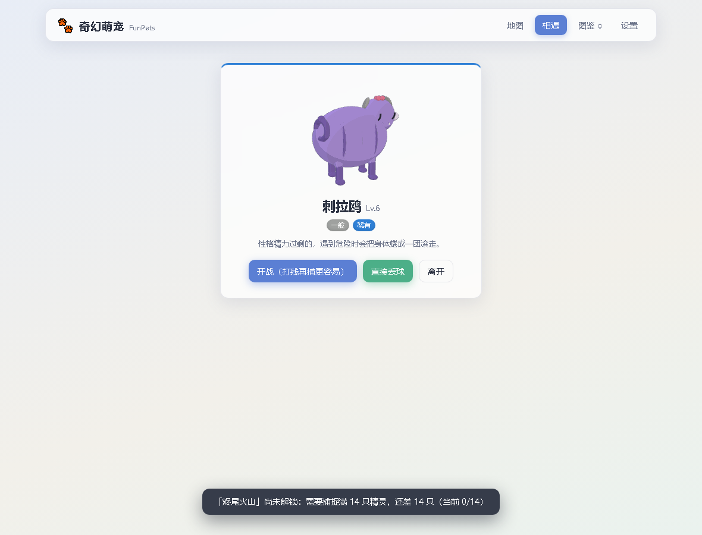

# 奇幻萌宠 FunPets 🐾

纯前端的原创精灵捕捉休闲游戏，参考 [Licoy/tihuqiche](https://github.com/Licoy/tihuqiche) 的工程模式（Vue 3 + Vite + GitHub Pages 官方 Actions 部署）。所有精灵均为随机生成的**原创**形象与名字，不包含任何现有动漫/游戏作品的受版权保护内容。



## 玩法

- **探索 6 张地图**：微风草原 → 月光浅滩 → 回声洞窟 → 烬尾火山 → 雾语秘林 → 天穹之巅（按捕捉数逐步解锁）。每张地图有不同的属性出没偏好和稀有度权重。
- **随机遭遇原创精灵**：18 属性系（可双属性）、5 档稀有度、个体值/性格/种族值随机掷点；造型由身体形状 × 耳朵 × 尾巴 × 花纹 × 配色 × 眼睛 × 饰品程序化拼装，组合空间上千万。
- **捕捉不限量**：普通精灵球无限供应。可以直接丢球，也可以开战打残后再捕（血量越低越容易）。
- **回合制对战**：属性克制、本系加成、会心一击、变化类技能；胜利获得经验，18 级进化（二阶形态）。
- **队伍与图鉴**：最多上阵 4 只，记录遇见过的每一只。
- **存档**：localStorage 本地保存 + 一键导出/导入 JSON（带校验，防脏数据）。
- **AI 生成（可选）**：设置页配置任意 OpenAI 兼容接口（Base URL / Model / API Key）后，每次刷新精灵由大模型生成名字、属性组合与图鉴描述；关闭或请求失败时自动降级本地随机。API Key 只存在你自己的浏览器里。

## 本地开发

需要 Node.js 18+。

```bash
npm install
npm run dev        # 开发热更新
npm run build      # 产物输出 dist/
npm run preview    # 本地预览构建产物
node tests/smoke.mjs   # Playwright 冒烟测试（需先 build；可用 PLAYWRIGHT_CHANNEL=chrome 复用本机 Chrome）
```

## 部署到 GitHub Pages

1. 新建仓库 `funny-pets`（与 `vite.config.js` 里的 `base: '/funny-pets/'` 一致；改名需同步修改）。
2. 推送代码到 `main` 分支。
3. 仓库 **Settings → Pages → Build and deployment → Source** 选择 **GitHub Actions**。
4. 之后每次推送自动构建部署；`.github/workflows/deploy.yml` 已就绪，无需 gh-pages 分支和个人令牌。

本地访问 `http://127.0.0.1:4173/funny-pets/`。

## 项目结构

```text
├── src/
│   ├── App.vue / main.js    # 应用与入口（单文件组件，视图内联在 App 中）
│   ├── data/
│   │   ├── types.js         # 18 属性 + 完整克制表
│   │   ├── maps.js          # 6 张地图（属性偏好/稀有度权重/主题）
│   │   ├── moves.js         # 按属性划分的技能池（全原创命名）
│   │   ├── names.js         # 名字库/图鉴模板/性格/稀有度
│   │   └── traits.js        # 造型特征库（SVG 素材维度）
│   ├── core/
│   │   ├── rng.js           # mulberry32 确定性随机（同 seed 同精灵）
│   │   ├── generator.js     # 本地精灵生成器
│   │   ├── evolve.js        # 数值成长/经验曲线/进化
│   │   ├── battle.js        # 回合制战斗引擎
│   │   ├── llm.js           # OpenAI 兼容客户端 + 输出校验 + 降级
│   │   └── sprites.js       # seed → 程序化 SVG 渲染
│   ├── store.js             # 全局响应式状态
│   └── storage.js           # 存档（版本化 + schema 校验 + 导入导出）
├── tests/smoke.mjs          # Playwright 冒烟测试
├── .github/workflows/deploy.yml  # Pages 自动部署
└── vite.config.js
```

## License

MIT
